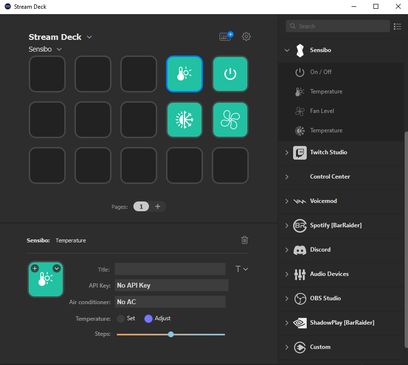

# Sensibo Plugin for Elgato Stream Deck

This  plugin allows controlling `Sensibo ` Air Conditioners .

# Features
- Code written in JavaScript
- Cross-platform (macOS, Windows)
- Localized
- Supports multiple Sensibo accounts
- Supports multiple Sensibo devices
- Supports setting temperature, mode, fan speed, and on/off

# Installation
In the [Release](./Release) folder, you can find the file `me.alhazmy13.sensibo.streamDeckPlugin`. If you double-click this file on your machine, Stream Deck will install the plugin.

# Source code
The [Sources](./Sources) folder contains the source code of the plugin.
